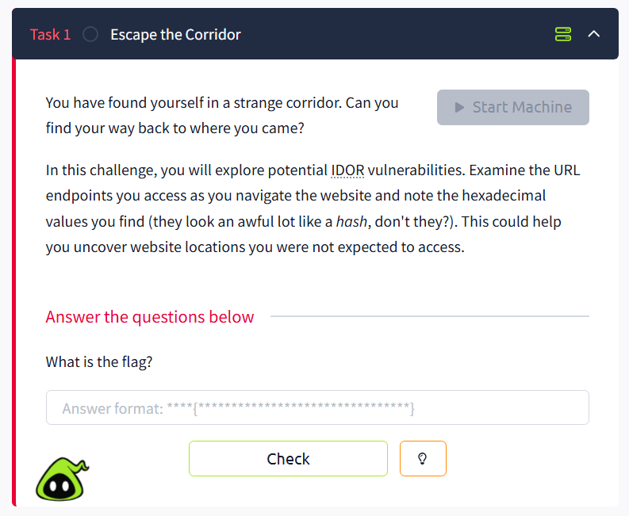
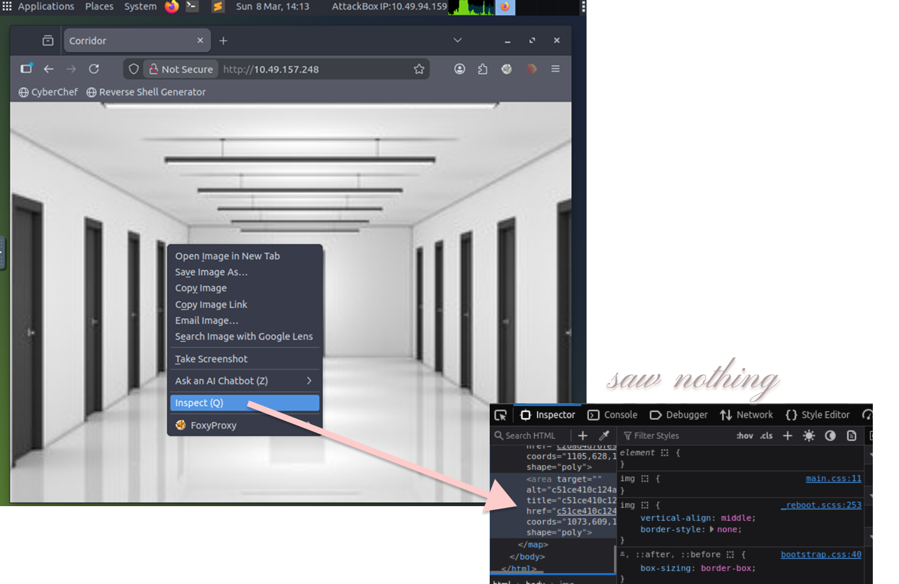
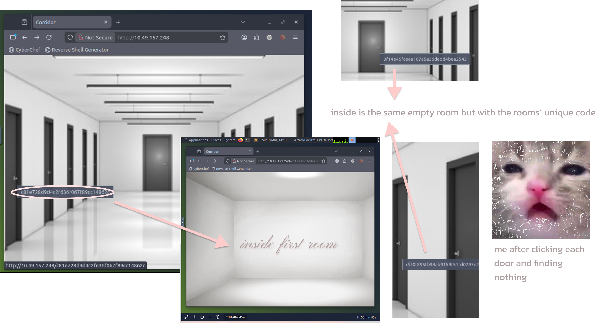
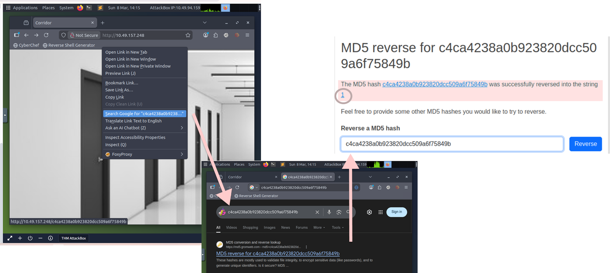

# First CTF without using hints ദ്ദി ༎ຶ‿༎ຶ )
baby steps :'3

## Challenge Info
Platform: 

Difficulty: Easy 

## Task

I was like, okay cool, lemme start up the AttackBox

# First Impressions
A corridor, title was being fr

♡ So being a total **newb**, first thing I did was inspect the page

so i moved on 

# Exploring
Found out that when I hover over each door, a long hexadecimal string pops up. When I click the door It led me to an empty room where the URL was the corridor's main IP address + their string.

# Hashes?
I remembered while reading the task there were some terms I wasn't familiar with but I kinda brushed it off as I thought they were not important, after me messing around I realized that hmmm.... maybe the task _was_ telling me something, so I googled what **hashes** and **IDOR** meant.

♡♡ AND THEN IT CLICKED TO ME....

Brought my focus back to the corridor and the number sequences, right-clicked the first door on the left, and googled the number sequence ( Which now I realize is a Hash ) 

♡♡♡ The first door's sequence turned out to be a hash of the number **1**, and I was like _Hmmmmmm_, tried it with the door beside number 1 and got 2 when decoding it, and my suspicions started to feel more justified, one more test to lock it in, using the middle door..

♡♡ Hence, my conclusion that the code from each door was a hash corresponding to the numbers 1–13.

# Final moments
♡ Since the doors appear to start from 1, I thought about the clue “way back = origin”. In programming and numbering systems, the origin often represents 0. Based on this idea, I generated the MD5 hash of 0, copied it into the corridor URL, and navigated to that page. This led me directly to the room containing the flag.

  ♡♡ We nailed it friends ദ്ദി( T ᗜ T ), also now I know that IDOR is a type of vulnerability that lets us access something by just changing an ID or identifier in the URL, because apparently that application doesn’t properly check permissions

# The Takeaway ₍ᐢ. .ᐢ₎ ₊˚⊹♡
♡ This challenge demonstrates a simple IDOR-style vulnerability, where predictable identifiers (in this case MD5 hashes of sequential numbers) can allow users to access resources that were not intended to be easily discovered, is how Chatgpt would describe it. Personally, my takeaway is that sometimes the simplest observations lead to the solution… and that my brain works HEHEHE 

