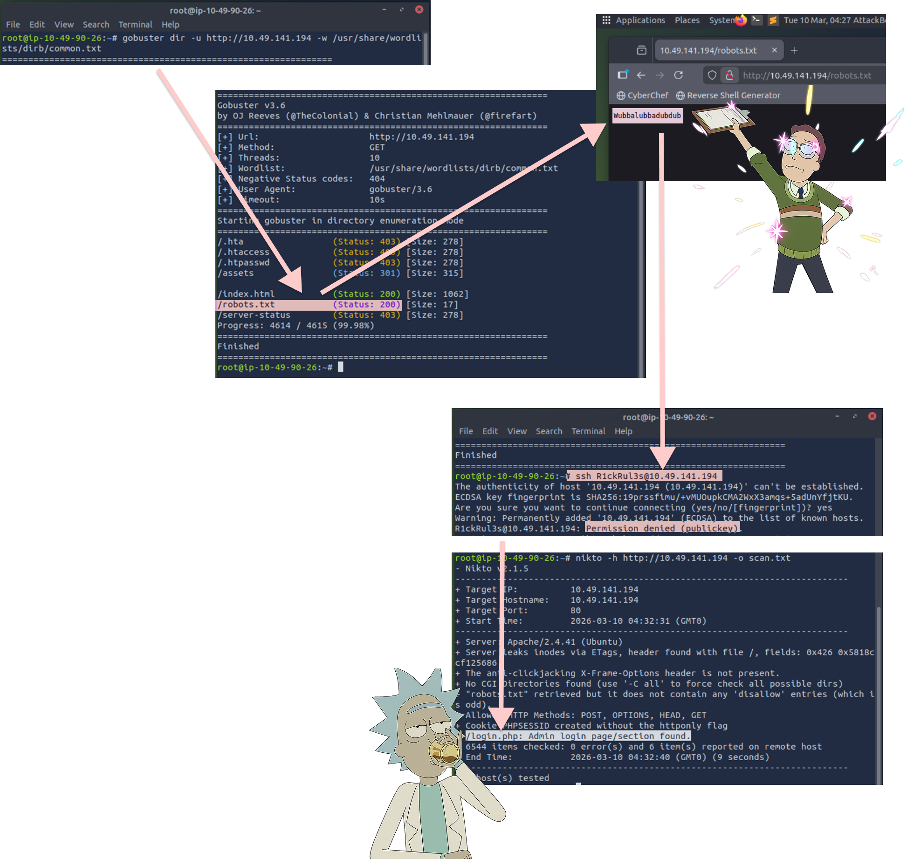
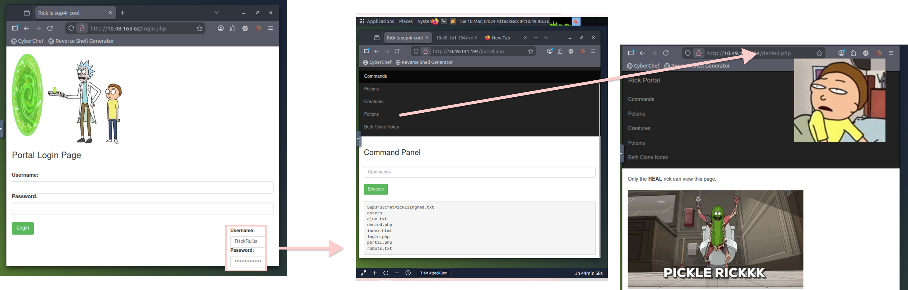
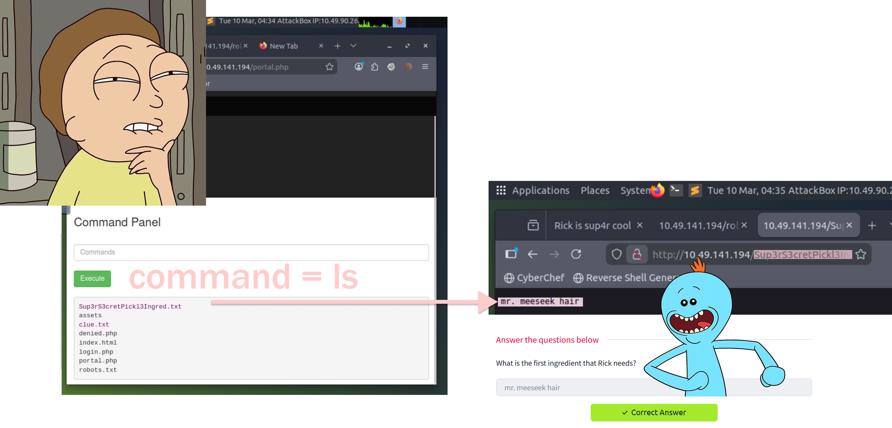
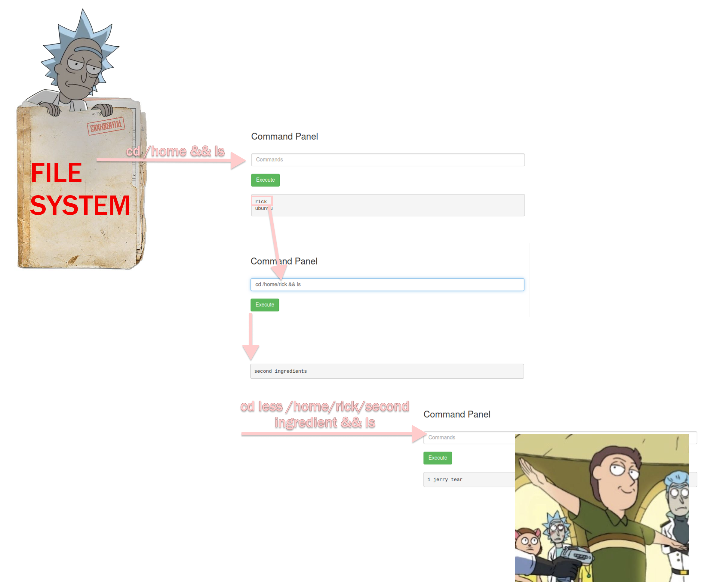
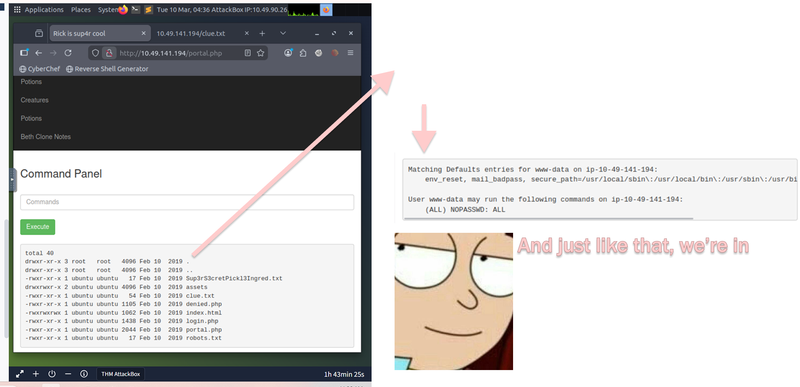
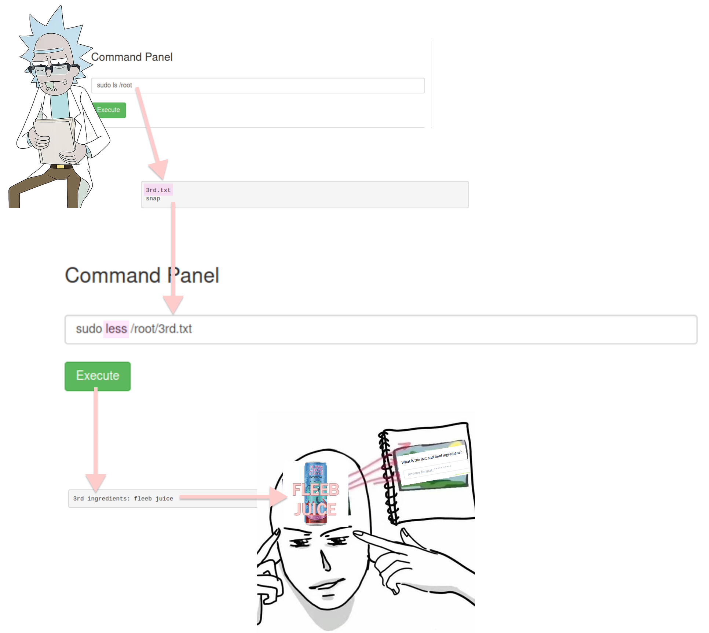

# 🥒 PICKLEE RICK !!!!! 🥒
That was my head screaming when I first saw the room in THM, needless to say, it caught my interest in an instant.

# Challenge Info
Platform: 

Difficulty: Easy 

# 🧪Task
Turn Rick back to human lol

# But how?
Hunt down three secret ingredients hidden within the web server

# 🔎 Recon Time 
After copying the machine’s IP, I was directed to Rick’s cry for help page. As usual, the first thing I did was inspect the page source. To my surprise, our first clue appeared immediately, Rick’s username hidden within the code.

And with a username present, we can only believe a login page and a password for that username exists somewhere, this is where Gobuster & Nikto shines.
I performed directory brute-forcing using Gobuster with a common wordlist. This revealed several interesting paths, including _/robots.txt._

Accessing the file exposed the string _Wubbalubbadubdub_, which appeared to be a potential credential or password.

Continuing the enumeration process, I also ran Nikto to scan the web server for additional misconfigurations and discovered a possible login portal at _/login.php._

# 📟Logging in
As I typed in _/login.php_ the site directed to the infamous login site.

Entered the credentials found earlier, I got in, first tab shows a command panel, but before i went into busting all the commands, i checked the other tabs in the navigation bar above, to quickly be reminded that I wasn't quite _"Rick"_ enough to access them.

# First Ingredient
Since I wasn’t “Rick enough” to access the other tabs, I shifted my focus back to the command panel. With my focus back on the command panel, I began testing basic Linux commands.

Running _ls_ revealed several files within the directory, one of which stood out: _Sup3rS3cretPickl3Ingred.txt._

Navigating to this file exposed the first ingredient Rick needed, mr. meeseek hair.

Score ( ¬⩊¬) got the first flag.

# Ingredient 2
Besides Sup3rS3cretPickl3Ingred.txt, another txt file caught my eye, _clue.txt_, after directing to it, a hint appeared

Following the hint from clue.txt, I began exploring the system’s file structure.

Running **cd /home && ls** revealed two user directories: _rick and ubuntu_. Since Rick was the target of the challenge, I navigated into his directory using **cd /home/rick && ls**

Inside, I discovered a file named _“second ingredients”_. Opening the file revealed the second ingredient needed for Rick’s potion: **1 jerry tear**. 

Judging by Jerry’s usual luck, probably wasn’t too hard for Rick to collect, considering how often Jerry cries lmaooo (☞ ͡° ͜ʖ ͡°)☞ 

# Final Ingredient - Privilege Escalation
While listing the files in the directory, I noticed several entries owned by root. This suggested that certain parts of the system might require elevated privileges to access.

To check whether the current user had any sudo permissions, I ran _sudo -l_

The output essentially translated to: “yeah bro… you have access.”

With this power on our hands, the /root directory was suddenly no longer off-limits.

With that, a quick  "_sudo ls /root_" revealed 3rd.txt, OMG THREEEEEEEEEEEEEEEEEEE

Hit it with another 
"_sudo less /root/3rd.txt_" 
to finally complete our quest

# 🔬Conclusion

By investigating the web application, exploring the system's filesystem, and escalating privileges with sudo, the final ingredient was retrieved and the challenge was completed.

Rick now has everything he needs to reverse the pickle experiment.

Now that the mission is done… it’s time to **get schwifty.** 

٩( ᐖ )人( ᐛ )و

